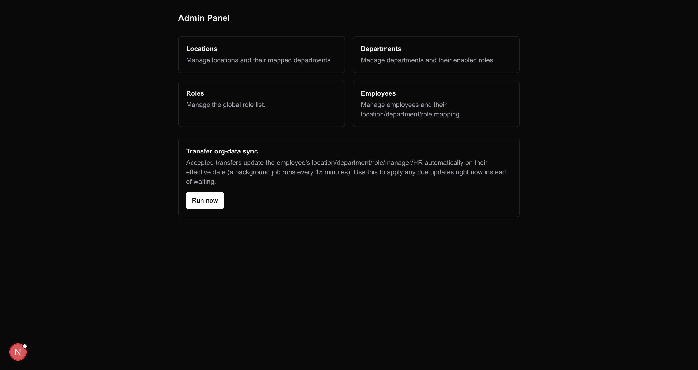
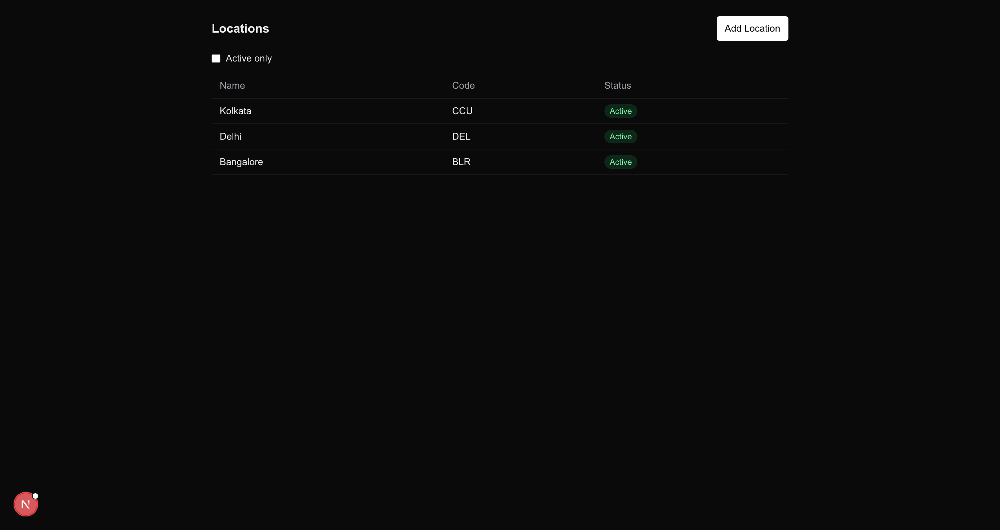
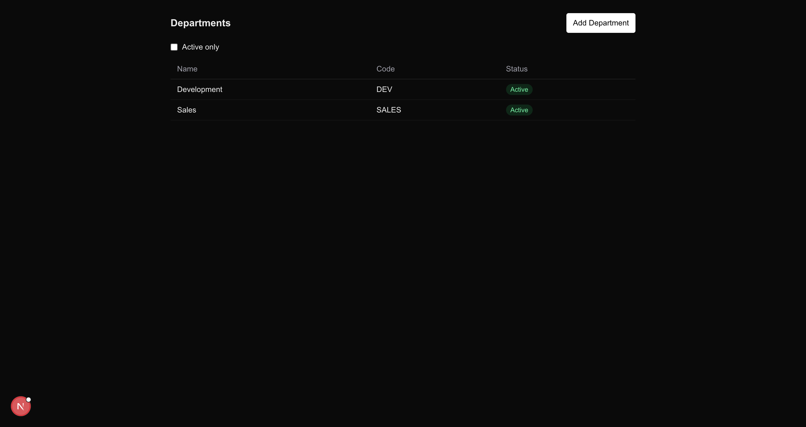
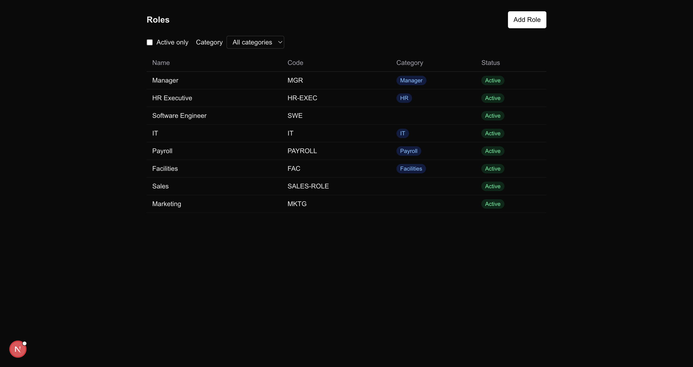
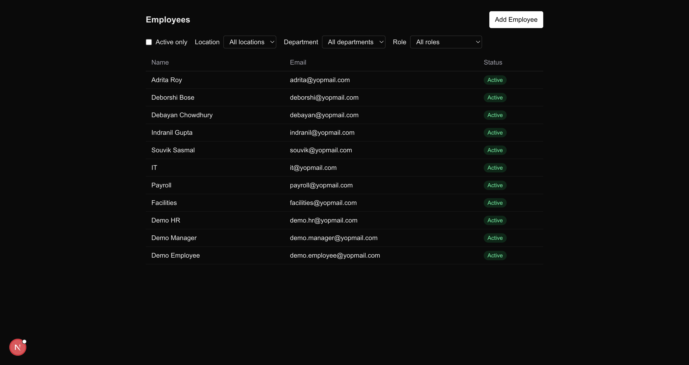

# One-Point Employee Portal — Internal Transfer System

A three-app system for submitting and processing internal employee transfer requests:

```
sdd-assessment/
├── backend/    Express + MongoDB API — owns all business logic and data
├── frontend/   Next.js — Employee portal (submit/track transfers, approvals)
└── admin/      Next.js — Admin panel (Locations/Departments/Roles/Employees)  ← this app
```

`backend`, `frontend`, and `admin` are independent git repos, living side by side, talking to each other only over HTTP. Stack: Node/Express + Mongoose (backend); Next.js + TanStack Query + Zustand + Tailwind (frontend/admin). No test suite is configured for `admin`.

## Clone and run

```bash
git clone <backend-repo-url>  backend
git clone <frontend-repo-url> frontend
git clone <admin-repo-url>    admin
```

**Backend** (port 4000):

```bash
cd backend
cp .env.example .env
npm install
npm run dev:all   # docker compose up (MongoDB) + nodemon
```

API docs at `/api-docs`, health check at `/api/health`, default admin login `admin`/`admin` (overridable via `ADMIN_USERNAME`/`ADMIN_PASSWORD` in the backend's `.env`) — a single static admin identity, not an Employee account.

**Admin panel** (this app, port 3001 — also Next.js, so give it a different port than the Employee portal):

```bash
cd admin
cp .env.example .env.local   # NEXT_PUBLIC_API_BASE_URL=http://localhost:4000/api/v1
yarn install
yarn dev -- -p 3001
```

**Employee portal** (port 3000, needs backend running):

```bash
cd frontend
cp .env.example .env.local
yarn install
yarn dev
```

## What the Admin panel manages

The org structure that the Employee portal's transfer workflow runs against:

- **Locations / Departments / Roles** — flat reference tables. A Location's detail page manages which Departments map to it; a Department's detail page manages which Roles are enabled for it (submitting a transfer to an unmapped Role now auto-creates that mapping rather than failing, so this screen is for pre-mapping/auditing, not a hard gate). A Role optionally carries a `category` — `HR`, `Manager`, `Payroll`, `IT`, `Facilities`, or none — which drives what an Employee holding it can see and do in the Employee portal. Only a regular Role (no category) can be self-service transferred into.
- **Employees** — CRUD: name/email/password, active flag, and Location/Department/Role/Manager/HR assignment.
- **Deleting/deactivating** a Location, Department, or Role still referenced elsewhere is rejected by the backend (`409`, dependents-count check) — the UI surfaces that error rather than allowing a dangling reference.
- **"Run now"** on the Dashboard manually applies any already-accepted transfer requests whose effective date has passed to the affected Employee's record — the same sweep the backend's cron runs every 15 minutes. It doesn't create or change transfer requests themselves; useful for testing without waiting.

## Walkthrough

Screenshots in [`screenshots/`](./screenshots):

| Page                                                      | Screenshot                                        |
| ----------------------------------------------------------- | ---------------------------------------------------- |
| Dashboard — nav into each resource, plus "Run now"           |                    |
| Locations — CRUD + Location↔Department mapping                |                     |
| Departments — CRUD + Department↔Role mapping                  |                   |
| Roles — CRUD, including `category`                            |                        |
| Employees — CRUD + Location/Department/Role/Manager/HR       |                    |

Full specs live under `backend/.ai-context/specs/` and `frontend/.ai-context/specs/`.
