# One-Point Employee Portal — Internal Transfer System

A three-app system for submitting and processing internal employee transfer requests:

```
sdd-assessment/
├── backend/    Express + MongoDB API — owns all business logic and data
├── frontend/   Next.js — Employee portal (submit/track transfers, approvals)  ← this app
└── admin/      Next.js — Admin panel (Locations/Departments/Roles/Employees)
```

`backend`, `frontend`, and `admin` are independent git repos, living side by side, talking to each other only over HTTP. Stack: Node/Express + Mongoose (backend); Next.js + TanStack Query + Zustand + Tailwind (frontend/admin).

## Clone and run

```bash
git clone <backend-repo-url>  backend
git clone <frontend-repo-url> frontend
git clone <admin-repo-url>    admin
```

**Backend** (port 4000):

```bash
cd backend
cp .env.example .env
npm install
npm run dev:all   # docker compose up (MongoDB) + nodemon
```

API docs at `/api-docs`, health check at `/api/health`, default admin login `admin`/`admin`.

**Frontend — Employee portal** (port 3000, needs backend running):

```bash
cd frontend
cp .env.example .env.local   # NEXT_PUBLIC_API_BASE_URL=http://localhost:4000/api/v1
yarn install
yarn dev
```

**Admin panel** (port 3001 — also Next.js, so give it a different port):

```bash
cd admin
cp .env.example .env.local
yarn install
yarn dev -- -p 3001
```

**Tests:** `cd backend && npm test` (Jest, 80% coverage enforced) · `cd frontend && yarn test` (Vitest). Admin has no test suite.

## The transfer request workflow

An Employee, Manager, HR, Payroll, IT, and Facilities are all just Employees whose Role's `category` decides what they can do. A request moves through a fixed chain:

```
Employee submits
  │
  ▼
Pending Current Manager Approval
  ├─ Approve → Pending Current HR Approval
  └─ Reject  → Rejected (terminal)

Pending Current HR Approval                 (tenure shown as a warning, not a hard block)
  ├─ Approve → Pending Receiving HR Approval
  └─ Reject  → Rejected (terminal)

Pending Receiving HR Approval                (HR assigns a Receiving Manager)
  ├─ Approve → Pending Receiving Manager Approval
  └─ Reject  → Rejected (terminal)

Pending Receiving Manager Approval
  ├─ Approve → Fulfillment Trigger
  └─ Reject  → another candidate manager left at that Location+Department?
                ├─ Yes → Pending Receiving HR Reassignment
                │          (Receiving HR picks a new manager)
                │          → back to Pending Receiving Manager Approval
                └─ No  → Hold
                           (Receiving HR can reopen within 6 months,
                            picking a new manager)
                           → back to Pending Receiving Manager Approval

Fulfillment Trigger → Pending Fulfillment    (Payroll / IT / Facilities, in parallel)
                        → all done → Completed
```

Reject is terminal (`Rejected`) at every gate except the Receiving Manager step, which instead loops back through reassignment or a holdable state — it's the only point in the chain a rejection doesn't end the request.

Escalation flags surface automatically if a request stalls (2 days in an approval gate, 5 business days in fulfillment) — informational only.

**Deferred org update:** accepting the Receiving HR gate doesn't move the employee immediately — their Location/Department/Role/Manager/HR change on the request's `effectiveDate`, applied lazily on their next authenticated call, by a 15-minute cron sweep, or via the Admin "Run now" button.

Full specs, API contracts, and business-rule amendments live under `backend/.ai-context/specs/` and `frontend/.ai-context/specs/`.

## Walkthrough

Screenshots in [`screenshots/`](./screenshots) follow one request end to end:

| Step                                              | Screenshot                                                                                 |
| -------------------------------------------------- | --------------------------------------------------------------------------------------------- |
| 1. Employee opens the transfer request form        | 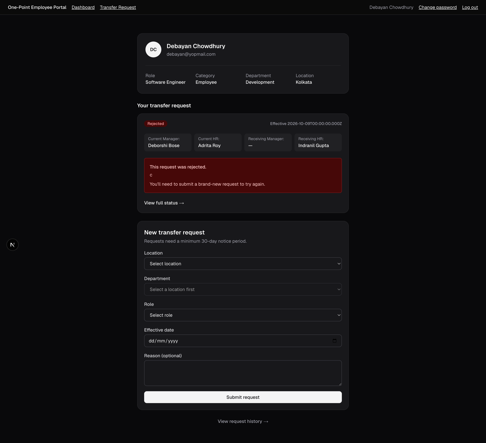                                            |
| 2. Employee submits — pending Current Manager       | 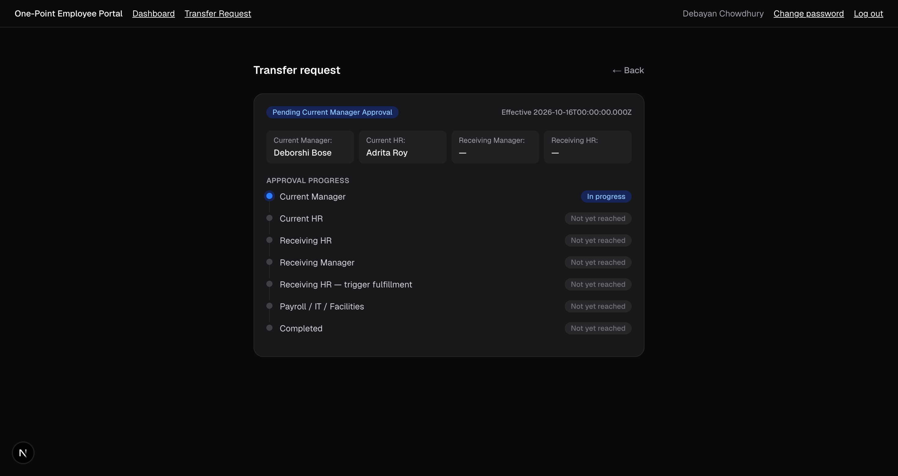                                          |
| 3. Current Manager decides                          | 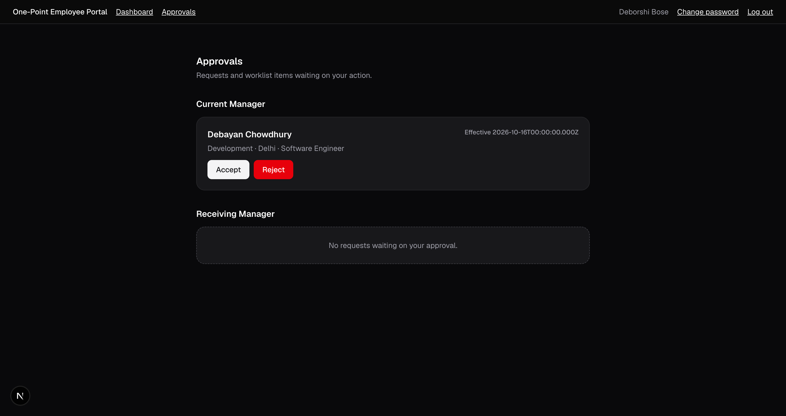                              |
| 4. Current HR decides                               | 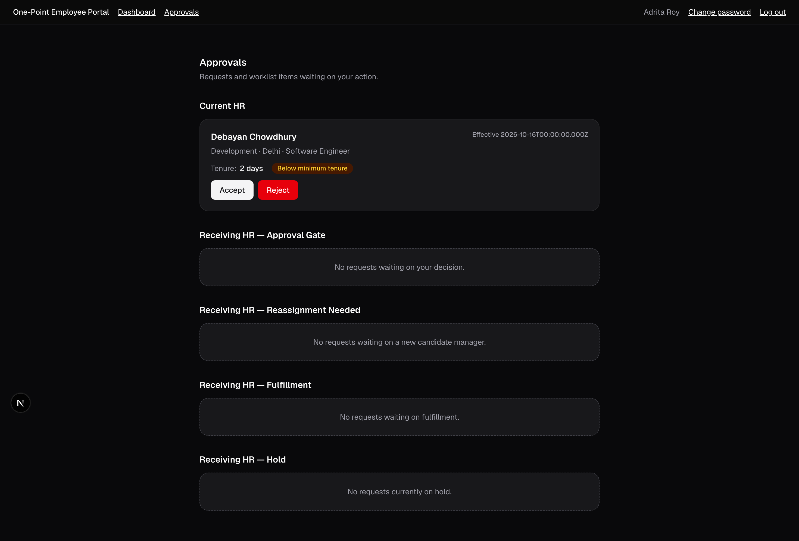                                  |
| 5. Receiving HR decides, assigns a Receiving Manager | 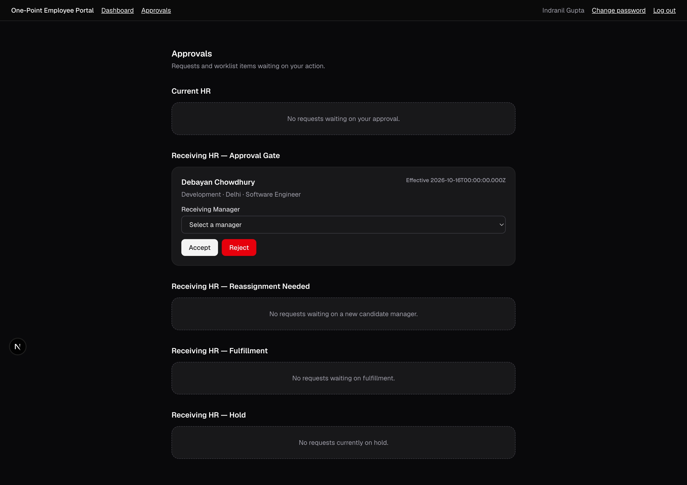                                |
| 6. Receiving Manager decides                        | 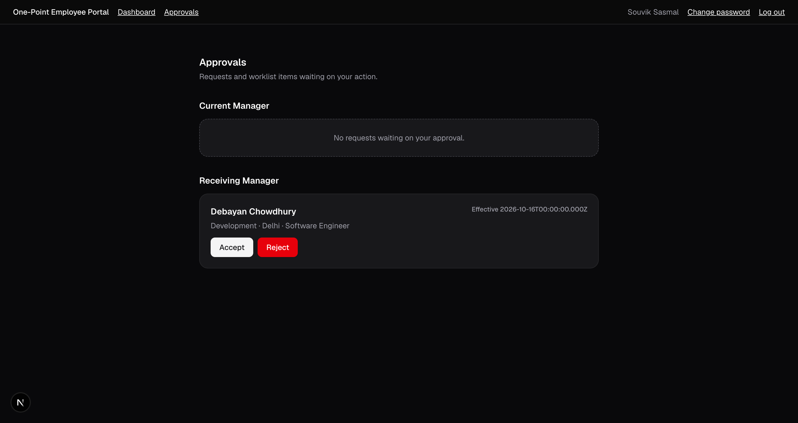                           |
| 7. Receiving HR triggers Payroll/IT/Facilities       | 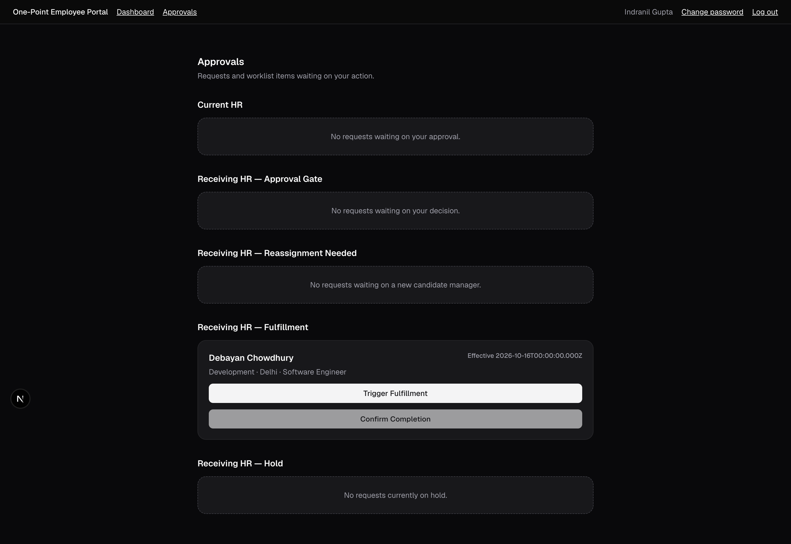                         |
| 8. IT marks done                                     | 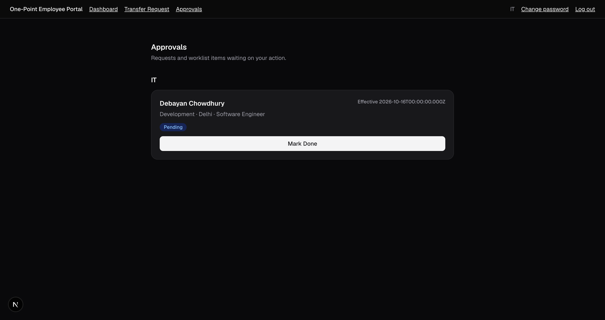                                                        |
| 9. Facilities marks done                             | 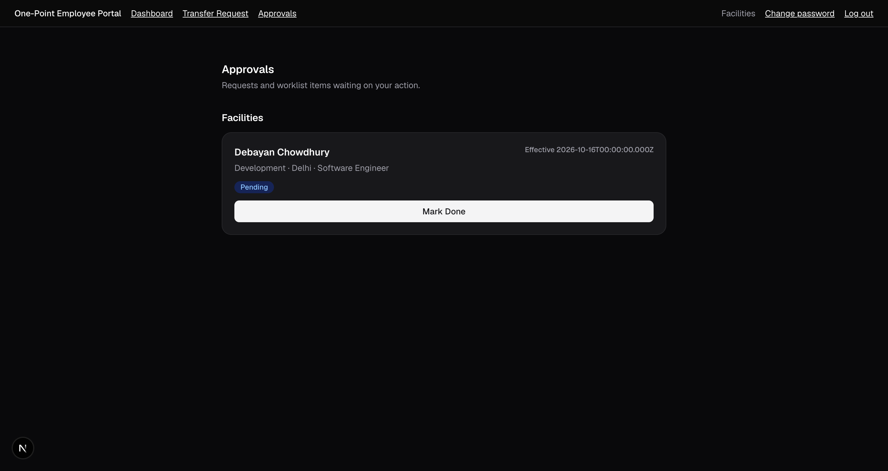                                                  |
| 10. Payroll marks done                               |                                                    |
| 11. Receiving HR confirms completion                 | 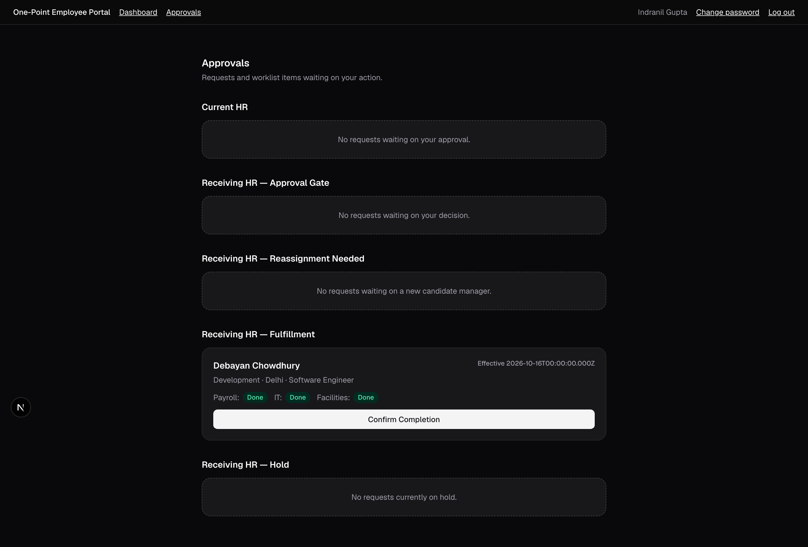                                                |
| 12. Employee sees the request `Completed`            | 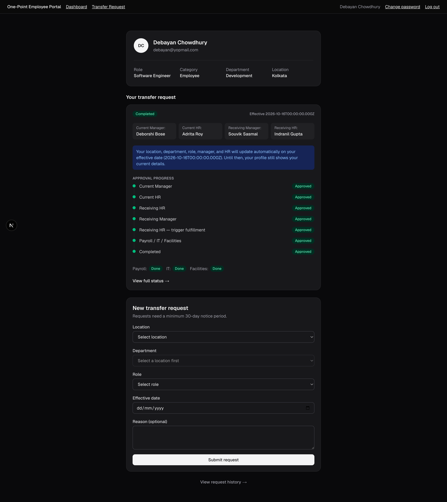                                       |
